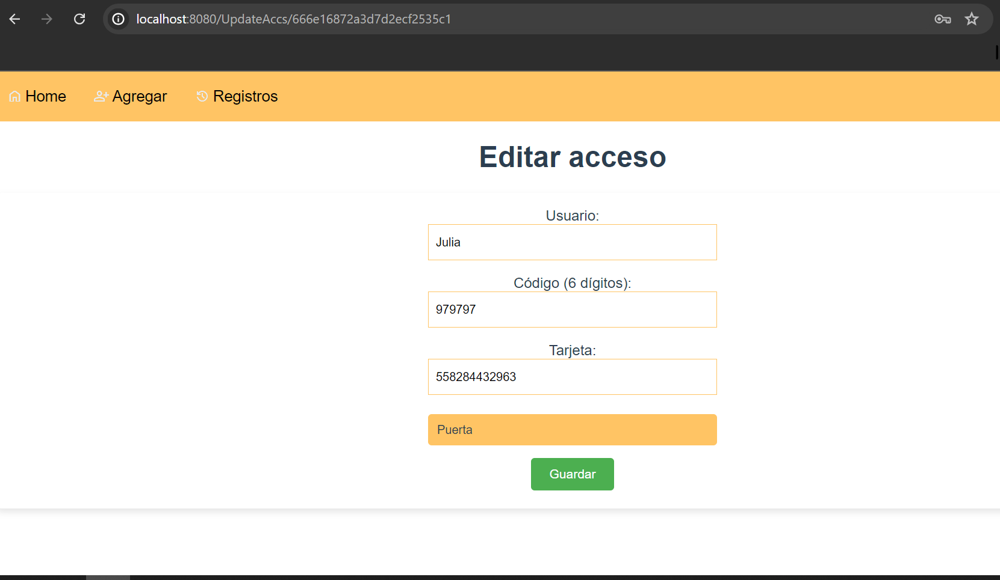

# Control de Acceso Web

Este proyecto consiste en una solución completa para el control de acceso utilizando un ESP32, un teclado matricial, un lector de tarjetas RC522, un servomotor y una pantalla LCD. El sistema se integra con un backend basado en Node.js y Express, y un frontend desarrollado con Vue.js. La comunicación entre el ESP32 y el servidor se maneja a través de MQTT y la gestión de usuarios se realiza mediante MongoDB.

## Estructura del Proyecto

El proyecto está organizado en dos partes principales: el backend y el frontend.

### Estructura del Directorio
```bash
control-acceso/
├── backend/
│ ├── config/
│ ├── controllers/
│ ├── middlewares/
│ ├── models/
│ ├── routes/
│ ├── services/
│ ├── utils/
│ ├── .env
│ ├── index.js
│ └── package.json
├── frontend/ctrlaccs
│ ├── public/
│ ├── src/
│ │ ├── assets/
│ │ ├── components/
│ │ ├── views/
│ │ ├── App.vue
│ │ ├── main.js
│ │ └── router.js
│ ├── .env
│ ├── package.json
│ └── vue.config.js
└── README.md
```

## Requisitos
- Vue.js
- Node.js
- MongoDB
- MQTT Broker

## Configuración
### Instalar MongoDB:
 Sigue las instrucciones oficiales de MongoDB para instalar el servidor en tu sistema operativo [aquí](https://www.mongodb.com/try/download/community).

### Crear Base de datos y colecciones
- Inicia MongoDB:
```bash
mongod --dbpath <ruta-a-tu-directorio-de-datos>

```
- Accede a la consola de MongoDB:
```bash
mongo
```
- Crea una base de datos llamada control_accesos:

```bash
use control_accesos
```
- Crea las colecciones necesarias:
```bash
db.createCollection("accs_users")
db.createCollection("platformUsers")
db.createCollection("registers")
```
### Backend

1. Clona el repositorio y navega al directorio `backend`:

```bash
   cd control-acceso/backend
```
2. Instala las dependencias:

```bash
npm install
```
3. Crea un archivo .env en la raiz del proyecto y configura las variables de entorno en el archivo.
```bash
PORT=3000
MONGO_URI=your_mongo_uri
MQTT_URI=mqtt://mqtt.eclipseprojects.io
MQTT_USER=user
MQTT_PASS=pass
JWT_SECRET=your JSON Web Token secret
```
4. Inicia el servidor:
```bash
npm start
```
### Frontend

1. Navega al directorio frontend:
```bash
cd control-acceso/frontend
```
2. Instala las dependencias:
```bash
npm install
```
3. Compila y sirve el proyecto:

```bash
npm run serve
```

# Uso
## Acceso a la Interfaz Web
Una vez que el backend y el frontend estén en ejecución, puedes acceder a la interfaz web en http://localhost:8080 (o el puerto que Vue.js indique).
## Gestión de Usuarios
- Crear Usuario: Accede a la página de registro en http://localhost:8080/SignUp y completa el formulario.


- Iniciar Sesión: Utiliza tus credenciales para iniciar sesión en http://localhost:8080/Login.


## Gestión de Usuarios de Acceso
Esta sección detalla cómo crear, editar y eliminar usuarios de acceso mediante la interfaz web del sistema de Control de Accesos. Las operaciones se realizan a través de formularios en el frontend, los cuales se comunican con el backend utilizando la API REST.

### Creación de Usuarios
Para crear un nuevo usuario de acceso:

- Accede a la página de creación de usuarios con el boton de la barra superior y
Completa el formulario:

- En esta pantalla se completan los campos


- Usuario: Nombre del usuario (debe ser único).
- Código (6 dígitos): Código de acceso del usuario (opcional, pero debe ser un número de 6 dígitos si se proporciona).
- Tarjeta: Número de tarjeta RFID (opcional, pero debe ser un número si se proporciona).
- Autorización: Selecciona el tipo de acceso (puerta, deshabilitado, cofre).
- Validaciones:

*El nombre de usuario debe ser único.
Al menos uno de los campos Código o Tarjeta debe ser proporcionado.
Si se proporciona Código, debe tener exactamente 6 dígitos numéricos.
Si se proporciona Tarjeta, debe ser numérico y único.*
Enviar el formulario:

- Presiona el botón Guardar.
Si el formulario es válido, el usuario será creado y se redirige a la pantalla de home.

### Editar y eliminar Usuarios
- En la pantalla de home, al lado de cada usuario se muestran dos botones, uno para editar el usuario selecionado y otro para eliminar.

- Al presionar el boton editar, redirige a la siguiente pantalla, donde se deben editar los datos que se desee.

- Para eliminar un usuario se debe presionar el boton que indica la eliminacion de usuario, y se abrirá un promp para aceptar o cancelar la eliminación.
### Visualizar Registros
- Para visualizar los registros se debe presionar el boton "Registros" de la barra superior

- Los registros se ordenan por fecha, de mas recientes a mas antiguos. Se puede filtrar por codigo de tarjeta o codigo de ingreso.


## Comunicación MQTT
Los dispositivos ESP32 se comunicarán con el servidor mediante los siguientes tópicos:

- /cntrlaxs/solicitud: Para registrar dispositivos.
- /cntrlaxs/solicitud/card: Para enviar solicitudes de acceso mediante RFID.
- /cntrlaxs/solicitud/code: Para enviar solicitudes de acceso mediante código.

## Diagrama de Comunicación

```bash
graph TD
    A[Dispositivo ESP32] -->|MQTT| B[Broker MQTT]
    B -->|MQTT| C[Servidor Backend]
    C -->|MongoDB| D[Base de Datos]
    C -->|API REST| E[Interfaz Web]

```
## Licencia
- Este proyecto está licenciado bajo la Licencia MIT.